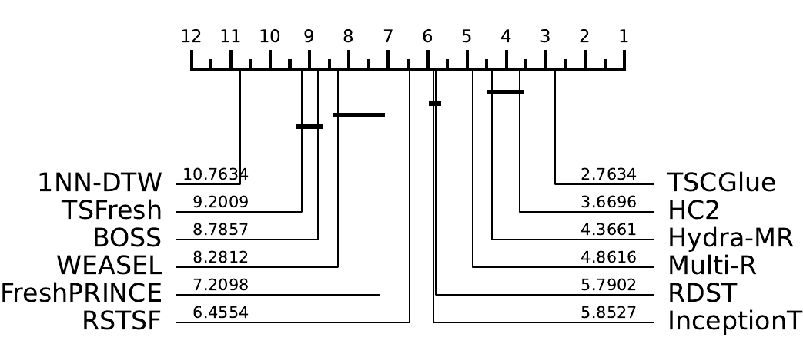

# TSCGlueClassifier

Automatic Time Series Classification library built on top of aeon and scikit-learn.

## Benchmark

Critical difference diagram evaluated on 112 univariate UCR datasets:



## Installation

```bash
# Base install (no PyTorch)
pip install tscglue

# Generic PyTorch (pip resolves version)
pip install "tscglue[torch]"

# CPU PyTorch (via uv)
uv pip install "tscglue[cpu]"

# CUDA 12.4 PyTorch (via uv)
uv pip install "tscglue[cu124]"
```

If you already have PyTorch installed, just install the base package — it won't reinstall torch.

## Quick Start

```python
from tscglue import utils
from tscglue.models import TSCGlueClassifier
from sklearn.metrics import accuracy_score

# Load a time series classification dataset
X_train, y_train, X_test, y_test = utils.load_dataset("ArrowHead")

# Create and train the model
model = TSCGlueClassifier(
    random_state=270,
    k_folds=10,
    n_jobs=-1
)
model.fit(X_train, y_train)

# Make predictions
y_pred = model.predict(X_test)
accuracy = accuracy_score(y_test, y_pred)
print(f"Accuracy: {accuracy:.4f}")
```


# TSCGlueV2 — preset composition

## Representations

Which representation is included in which preset.

| Representation | Family | low | medium | high |
|---|---|:--:|:--:|:--:|
| `multirocket` + `hydra` | convolution | ✅ | ✅ | ✅ |
| `quant` | interval quantile | ✅ | ✅ | ✅ |
| `rstsf-random` | interval | ✅ | ✅ | ✅ |
| `rdst` | shapelet | ✅ | ✅ | ✅ |
| `weasel` | dictionary | ❌ | ✅ | ✅ |
| `fm` (`mantis` + `chronos2`) | foundation | ❌ | ✅ | ✅ |
| `drcif` | interval | ❌ | ❌ | ❌ |
| `tsfresh` | feature-based | ❌ | ❌ | ❌ |

## Base models (level 0)

`low` = `medium` minus `weasel` and `fm` — identical model names and heads on the four shared
representations. `high` = same six representations, but **two** heads each.

| Representation | low | medium | high |
|---|---|---|---|
| `multirocket` + `hydra` | `bestk-ridgecv` | `bestk-ridgecv` | `bestk-ridgecv`, `et` |
| `quant` | `et` | `et` | `ridgecv`, `et` |
| `rstsf-random` | `et` | `et` | `ridgecv`, `et` |
| `rdst` | `ridgecv` | `ridgecv` | `ridgecv`, `et` |
| `weasel` | ❌ | `bestk-ridgecv` | `bestk-ridgecv`, `et` |
| `fm` | ❌ | `ridgecv` | `ridgecv`, `et` |
| **total models** | **4** | **6** | **12** |
| **heads per representation** | 1 | 1 | 2 |

## Stacking models (level 1)

Trained on the level-0 models' OOF probabilities. `medium` and `high` train **all five**.
`low` trains **exactly one**, chosen by `eval_metric`.

| Stacking model | low | medium | high |
|---|:--:|:--:|:--:|
| `ridgecv` | ✅ \* | ✅ \*\* | ✅ \*\* |
| `logisticcv` | ❌ | ✅ | ✅ |
| `et` | ✅ \* | ✅ | ✅ |
| `nn` | ❌ | ✅ | ✅ |
| `rf` | ❌ | ✅ | ✅ |
| **total stackers** | **1** | **5** | **5** |

\* `low` trains only **one** of these two, chosen by `eval_metric`: `ridgecv` for `accuracy` /
`f1`, `et` for `log_loss` / `roc_auc` — the existing `TSCGlueClassifier` mapping (ridge wins
accuracy, ExtraTrees wins log-loss and AUC, per the critical-difference study). **`f1` is not
in that mapping yet and needs a decision** (`ridgecv` proposed, matching `accuracy`).

\*\* `ridgecv` is trained and Brier-scored, but **excluded from the stack-mean** — its
decision-function pseudo-probabilities are uncalibrated and would skew the average. It is
therefore only actually served if Brier selection picks it over the mean.

## Level-2 head

What combines the level-1 stackers into the served prediction. One head per preset.

| Level-2 head | low | medium | high |
|---|:--:|:--:|:--:|
| `probability-stack-mean` | ❌ | ✅ | ❌ |
| `probability-et-l2-all` | ❌ | ❌ | ✅ |

## Fallback

A single model replacing the whole stack when the stack cannot be built. Not an ensemble
member — when it fires it is the *only* thing served, for every prediction.

| Fallback | low | medium | high |
|---|:--:|:--:|:--:|
| `MRHydraET` | ✅ | ✅ | ✅ |
| `MultiRocketHydraClassifier` | ❌ | ❌ | ❌ |

### Triggers

Two, both hard failures of the cross-validation the stack is built on:

1. **Any class with fewer than 2 instances** — no stratified fold split is possible, so no OOF
   probabilities exist to stack.
2. **NaNs in the assembled OOF probability matrix** — a base model failed to produce
   predictions for some rows, so the level-1 input is incomplete.

Both are decided during `fit`. Once a fallback is persisted, `predict` / `predict_proba` route
to it unconditionally and no level-1 or level-2 code runs.

### Why `MRHydraET`

Both candidates use the same `multirocket` + `hydra` features; only the head differs. The
ridge-based `MultiRocketHydraClassifier` has no `predict_proba` — its decision function yields
effectively one-hot probabilities, costing ~34.5 log-loss per misclassified sample. `MRHydraET`
uses an ExtraTrees head with probabilities clipped away from zero (`PROBA_EPS`), so a
misclassified sample costs a bounded amount.

This is the single largest log-loss effect measured anywhere in the design — larger than any
level-0, level-1 or level-2 choice — because fallback datasets are exactly the small/degenerate
ones where errors are common. **All three presets use `MRHydraET`; this is not a preset axis.**

Other `TSCFeatureBaseline` subclasses exist (`QuantET`, `MultiET`, `ShapeDictET`,
`AllFeaturesET`, `MRHydraLogistic`, `MRHydraRidge`, `AllFeaturesRidge`) and are individually
benchmarked, but only the multirocket+hydra pair has been compared *as a fallback*. Swapping in
a different one is untested.
