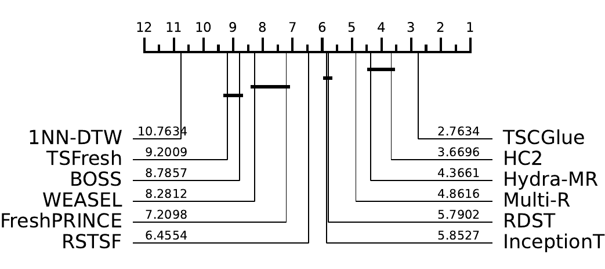

# TSCGlueClassifier

Automatic Time Series Classification library built on top of aeon and scikit-learn.

## Benchmark

Critical difference diagram evaluated on 112 univariate UCR datasets:



## Installation

```bash
# Base install (no PyTorch)
pip install tscglue

# Generic PyTorch (pip resolves version)
pip install "tscglue[torch]"

# CPU PyTorch (via uv)
uv pip install "tscglue[cpu]"

# CUDA 12.4 PyTorch (via uv)
uv pip install "tscglue[cu124]"

# CUDA 13.2 PyTorch (via uv)
uv pip install "tscglue[cu132]"
```

Neither CUDA build covers every card: `cu124` ships kernels for sm_50-sm_90, `cu132` for
sm_75-sm_120. Pick `cu132` for Blackwell (sm_120) and `cu124` for pre-Turing cards.

If you already have PyTorch installed, just install the base package — it won't reinstall torch.

## Quick Start

```python
from tscglue import utils
from tscglue.models import TSCGlueClassifier
from sklearn.metrics import accuracy_score

# Load a time series classification dataset
X_train, y_train, X_test, y_test = utils.load_dataset("ArrowHead")

# Create and train the model
model = TSCGlueClassifier(
    random_state=270,
    k_folds=10,
    n_jobs=-1
)
model.fit(X_train, y_train)

# Make predictions
y_pred = model.predict(X_test)
accuracy = accuracy_score(y_test, y_pred)
print(f"Accuracy: {accuracy:.4f}")
```


# Preset composition

Which models each `(preset, eval_metric)` pair actually uses to produce its prediction.

| Model | `low` Acc. | `low` LL | `medium` Acc. | `medium` LL | `high` Acc. | `high` LL | `best` any |
|---|:---:|:---:|:---:|:---:|:---:|:---:|:---:|
| **Level 0: base models** |  |  |  |  |  |  |  |
| MultiRocket + Hydra | R | R | R | R | R, ET | R, ET | R, ET |
| QUANT | ET | ET | ET | ET | R, ET | R, ET | R, ET |
| RDST | R | R | R | R | R, ET | R, ET | R, ET |
| RSTSF | ET | ET | ET | ET | R, ET | R, ET | R, ET |
| MantisV2 + Chronos-2 |  |  | R | R | R, ET | R, ET | R, ET |
| WEASEL 2.0 |  |  | R | R | R, ET | R, ET | R, ET |
| **Number of representations** | **5** | **5** | **8** | **8** | **8** | **8** | **8** |
| **Number of base models** | **4** | **4** | **6** | **6** | **12** | **12** | **12** |
| **Level 1: stacking models used** |  |  |  |  |  |  |  |
| R | ✓ |  |  |  |  |  | ✓ |
| LR |  |  | ✓ |  |  |  | ✓ |
| ET |  | ✓ | ✓ | ✓ |  | ✓ | ✓ |
| RF |  |  | ✓ |  |  |  | ✓ |
| MLP |  |  | ✓ |  | ✓ |  | ✓ |
| R-b |  |  |  |  |  |  | ✓ |
| LR-b |  |  |  |  | ✓ |  | ✓ |
| ET-b |  |  |  |  | ✓ |  | ✓ |
| RF-b |  |  |  |  | ✓ |  | ✓ |
| **Number of stacking models used** | **1** | **1** | **4** | **1** | **4** | **1** | **9** |
| **Level 2: combining model used** |  |  |  |  |  |  |  |
| Mean\* |  |  | ✓ |  |  |  |  |
| Mean-b\* |  |  |  |  | ✓ |  |  |
| ET |  |  |  |  |  |  | ✓ |

\* From previous layer only.
